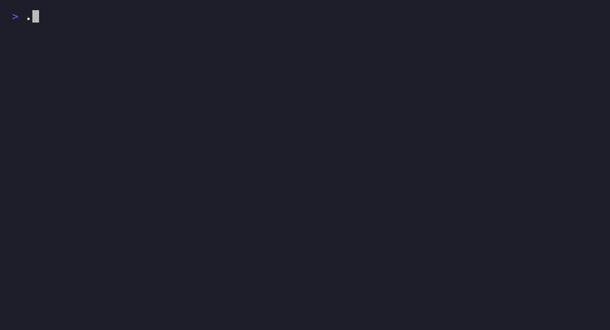

# downbeat

[](https://pypi.org/project/downbeat/)
[](https://pypi.org/project/downbeat/)
[](https://github.com/FreddieMcHeart/downbeat/actions/workflows/ci.yml)
[](https://freddiemcheart.github.io/downbeat/)
[](./LICENSE)

Stop copy-pasting between AI terminals. downbeat is a local, human-in-the-loop
message bus for coordinating parallel AI coding-agent sessions on one machine —
register a few peers, hand off tasks, and read replies back, all through a
filesystem-backed broker + TUI + CLI + skill. Nothing happens without you: every
watcher notifies, nothing auto-executes on the parent side, and a child only acts
because you told it to at registration time.



Want to see it before installing? [`examples/parent-child-handoff/`](./examples/parent-child-handoff/)
is a five-command walkthrough of the whole loop (this GIF is `demo.sh` from that
directory, recorded verbatim with [VHS](https://github.com/charmbracelet/vhs)).

## Install

```bash
uv tool install downbeat     # or: pipx install downbeat
downbeat init                # one command installs the WHOLE runtime
```

`downbeat init` is the single source of truth for the entire relay runtime. It:

- bootstraps `~/.claude/relay/` data dirs and migrates legacy messages,
- installs the **skill** → `~/.claude/skills/downbeat/`,
- writes the `relay.py` **shim** → `~/.claude/relay/relay.py`,
- installs the bundled **hooks** (`relay-inbox.py`, `relay-poll-offer.py`) → `~/.claude/hooks/` (chmod +x),
- installs the bundled **slash commands** (`relay-register/send/reply/peers/monitor.md`) → `~/.claude/commands/`,
- **registers** the relay hooks in `~/.claude/settings.json` (idempotent, backed up, atomic).

It is safe to re-run: content-equal files are left as-is, already-registered hooks are
skipped, and a hook that differs from the bundled copy is **kept** (your local edit
wins) unless you pass `--force`. settings.json edits never clobber non-relay hooks
sharing the same event/matcher.

downbeat also ships as a native **Claude Code plugin** (`claude plugin install
downbeat`) — an optional, Claude-Code-only fast path alongside `init`'s hand-merge,
not a replacement for it. See [docs/plugin.md](./docs/plugin.md) for how the two
coexist (and what to do if you ran `init` before installing the plugin).

## Use

```bash
downbeat register parent --role parent
downbeat register child  --role child
downbeat send child "task" "do the thing"
downbeat inbox --peer child
downbeat reply <msg_id> "done"
downbeat tui                 # full management UI
```

`kind` is an open string: `task` (default for all normal messages) and `backflow-ready`
(structured RLM findings from a child — see the downbeat skill). Future kinds
(`workflow-request`, `workflow-result`) are planned for Phase 3.

### Always-on inbox watch

Give a child session always-on inbox awareness after pairing:

```bash
downbeat watch                     # event-driven (fswatch/FSEvents); instant, ~0 idle cost
downbeat watch --peer child-1      # parent watching a child's inbox
downbeat watch --poll              # force poll fallback (every --interval seconds)
downbeat watch --interval 30       # poll fallback interval (default: 90s)
downbeat watch --once              # one-shot: print all current NEW, then exit
```

Run `downbeat watch` in the child terminal (or as a Monitor job) immediately
after `downbeat register`. The watcher notifies only — it never drains, acks,
or takes any action. The human (or the session's hook at the next prompt) drives action.
Stop with Ctrl+C.

`watch` is event-driven by default (uses watchdog FSEvents/inotify — fires instantly on
inbox changes, near-zero idle CPU). If watchdog is unavailable it falls back to polling
automatically and prints `[watch] polling every Ns` on startup so you always know which
backend is active. Use `--poll` to force the interval fallback regardless.

**watch-vs-monitor cost table:**

| Want | Use | Cost on idle channel |
|---|---|---|
| Cheap notify-to-wake, you act when woken | `downbeat watch` as a Monitor | ~0 (blocks on FS event; model turn only on real mail) |
| Session auto-acts role-aware on a cadence | `/relay-monitor` (/loop) | a model turn every interval |

### Background inbox polling

The first time you invoke a relay action in a Claude Code session, the skill
offers to start a 3-minute inbox poll via `/loop`. Accept to get notified of
incoming messages without having to manually check.

### Continuous self-monitoring (/relay-monitor)

In a registered Claude Code session, run the `/relay-monitor` slash command to make that
session continuously pull its own inbox and act on new messages:

```
/relay-monitor          # start monitoring, default 3-minute interval
/relay-monitor 5m       # custom interval
/relay-monitor stop     # stop
```

Behaviour is role-asymmetric:

- **child session:** auto-executes arriving tasks per its role briefing and replies with results
  (consent-at-startup autonomy).
- **parent session:** surfaces new messages concisely and asks the human how to handle each;
  never auto-executes.

Before starting the monitor, check your identity with:

```bash
downbeat whoami          # prints: <name> <role>
downbeat whoami --json   # prints: {"name": "...", "role": "..."}
```

**watch vs /relay-monitor — key distinction:**

| | `downbeat watch` | `/relay-monitor` |
|---|---|---|
| Runs as | external process (pane / Monitor job) | in-session `/loop` |
| Backend | event-driven (FSEvents/inotify), poll fallback | timer-based loop |
| Does | prints new mail to a pane (human reads) | session pulls mail into its own context + acts per role |
| Acts? | never | child: yes (autonomous); parent: no (surfaces) |
| Idle cost | ~0 (event-driven; model turn only on real mail) | a model turn every interval |
| Use when | operator watching from outside | a session should self-drive on its inbox |

Both tools are complementary and can be run simultaneously.

### TUI keybindings

| Key           | Action                                               |
|---------------|------------------------------------------------------|
| Tab/Shift+Tab | Cycle focus: Messages → Composer                     |
| s             | Switch acting-as parent                              |
| a             | Toggle archived history (chat view, 📥 inbox tab)    |
| c             | Clear inbox — archive this peer's backlog → processed/ (chat view, 📥 inbox tab) |
| Left/Right    | Prev / next group member                             |
| Up/Down       | Within focused region (messages, composer)           |
| Enter         | Send (in composer) / Open message detail (in message list) |
| Escape / q    | Back (in message detail)                             |
| e             | Edit (in message detail, only NEW)                   |
| r             | Reply (in message detail)                            |
| d             | Delete with confirm (in message detail)              |
| Shift+B       | Broadcast status (in message detail, when applicable) |
| y             | Yank (copy) message body to clipboard (chat view and message detail) |
| c             | Copy message id to clipboard (in message detail)     |
| Up/k, Down/j  | Scroll up / down in message detail                   |
| Ctrl+B / PgUp | Page up in message detail (Fn+↑ alias)               |
| Ctrl+F / PgDn | Page down in message detail (Fn+↓ alias)             |
| g / Home      | Top of message detail (Fn+← alias)                  |
| G / End       | Bottom of message detail (Fn+→ alias)                |
| Ctrl+P        | Peers screen (add / remove / gc)                     |
| f             | Find message by id                                   |
| ? / F1        | Help                                                 |
| Ctrl+R        | Refresh                                              |
| Ctrl+L / F6   | Toggle log viewer                                    |
| q             | Quit                                                 |

## Uninstall

```bash
downbeat uninstall    # removes skill + shim + hooks + commands + relay
                          # settings.json regs; leaves data + backups in ~/.claude/relay
```

## Layout

- Source: `src/downbeat/{core,cli,tui,skill}`
- Bundled runtime assets: `src/downbeat/assets/{hooks/,commands/,hooks_manifest.json}`
- Tests: `tests/`
- Examples: [`examples/`](./examples/)
- Docs site: [freddiemcheart.github.io/downbeat](https://freddiemcheart.github.io/downbeat/) ([source](./docs/))
- State: `~/.claude/relay/{sessions.json, inbox/, processed/, logs/, groups.json}`
